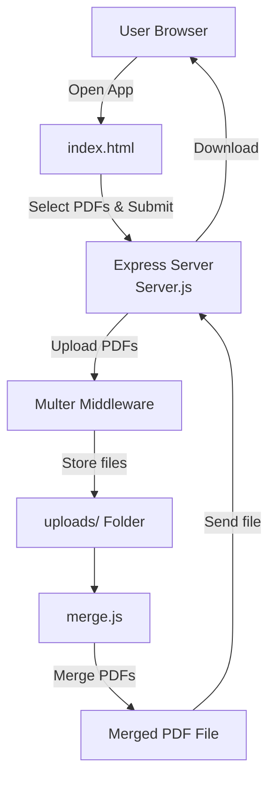

# PDF_Merger
A friendly and efficient Node.js + Express PDF merging tool that lets users upload multiple PDF files and merges them into a single combined document in a few clicks.
This project saves you from time-consuming manual PDF merging and provides a simple backend that handles uploads, merging, and serving the merged PDF.

### Features
1. Upload multiple PDF files at once
2. Automatically merge uploaded PDFs into one file
3. Serves merged PDF back to user for download
4. Simple UI form (in template/index.html) to select files
5. Stores uploads temporarily in uploads/ before merging

### Project Structure


### How it works
1. How It Works
2. User opens web page with an upload form.
3. User selects 2+ PDF files to upload.
4. Multer handles file upload and saves PDFs in uploads/.
5. The app sends file paths to the merge logic in merge.js.
6. PDFs are merged using a library like pdf-merger-js.
7. Merged file is saved to disk (e.g., in public/ or merged/).
8.Server responds with merged PDF for download.

### Flow Diagram
```mermaid
flowchart LR
    A[Client] -->|GET /| B[Upload Form]
    B -->|POST PDFs| C[Server (Express)]
    
    C -->|Save files| D[uploads/]
    C -->|Call merge logic| E[merge.js]
    
    E -->|Read PDFs| D
    E -->|Merge via pdf-merger-js| F[Merged PDF]
    
    F -->|Return| G[Client Download]
```
